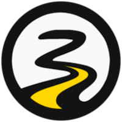

# Project Overview


**Ozmium** ($**OZ**) \['äz'mēəm] combines **Oz-** (_an ideal or fantastical place_) with **-mium** (_like an element_) to call to mind ideal and fantastical elements powered by a tangible expression of real human belief, a weight of which we call the units "**onz\[es]**" and notate them as **oz**. (e.g., _one-hundred Ozmium_ is _100oz_.)


**Exclusively on Base,** this token is the only official token of the _Oz_ GameFi storytelling system available across multiple platforms. The unique token economy proposed in this concept purports to do more for the Base and Ethereum ecosystems than exist as a product and project token by aspiring to:

1. develop around involving both Base Ethereum Virtual Machine (EVM) and validator yield systems;
2. contribute to attraction of long-term Ethereum circulation into the Base Layer 2 ecosystem; and,
3. sufficiently incentivize participant-driven balance to perform in parity with Base and EVM scaling.

<figure><figcaption>
The Ozmium (OZ) Token Logo
</figcaption></figure>

Unlike most gameplay virtual tokens, Ozmium in tandem with the _Oz_ client will focus on principles of cost- and technological- conscious decision making, and not the benefit of a centralized content facilitator. The goal is to provide a multi-utility fair market token with a commons-shared system in how to build game world currencies in a meaningful way.&#x20;


The success of Ozmium is meant to help build Base and help build up the builder community with an economic-conscious application of blockchain to digital entertainment. The ultimate vision is to build the next generation of story sharing entertainment that benefits both players and the network we build on **first.**


A secondary goal is to showcase the power of humanity in collaboration on-chain, and for such example, our inclusion of [Clanker](https://clanker.world/) being the contract and launchpad in which the Ozmium token was created and liquidity pool handled through instead of building our own proprietary project token is done both out of efficiency and out of a collaborative ecosystem that supports each others' good works.
